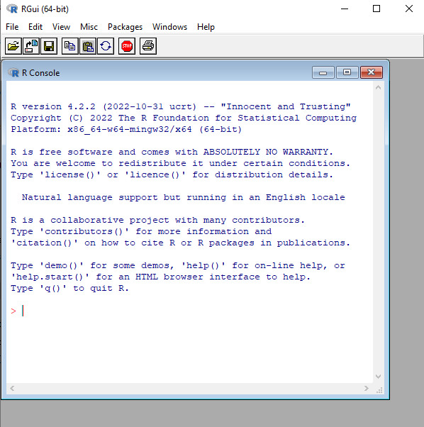

# Download and install R and RStudio

If you want to use R and RStudio to analyse the data for your MSc dissertation, you will need to download and install R and RStudio in your own computer. This page presents a step-by-step on how to do it. 

R is the statistical programme (and language) that will perform all the calculation and produce data visualisation for you. However, R is not a very user-friendly.  

RStudio is a cross-platform integrated development environment (IDE) for the R statistical language

## Why do we use R as our statistical language and programme?

R is an open source, flexible and powerful language and statistical programme. It consists of a core which carries out standard statistical calculations, and a very large library of packages to do specialist functions - from amazing [data visualisations](r-graph-gallery.com/) to [apps](shiny.rstudio.com/gallery/)!

## 
To download and install R, go to https://cran.r-project.org/.
You need to select the version that matches your operating system (Linux, macOS or Windows). 
 

## 
To download and install RStudio, go to https://posit.co/downloads/

RStudio is currently beung rebranded as 'Posit'- Explain
