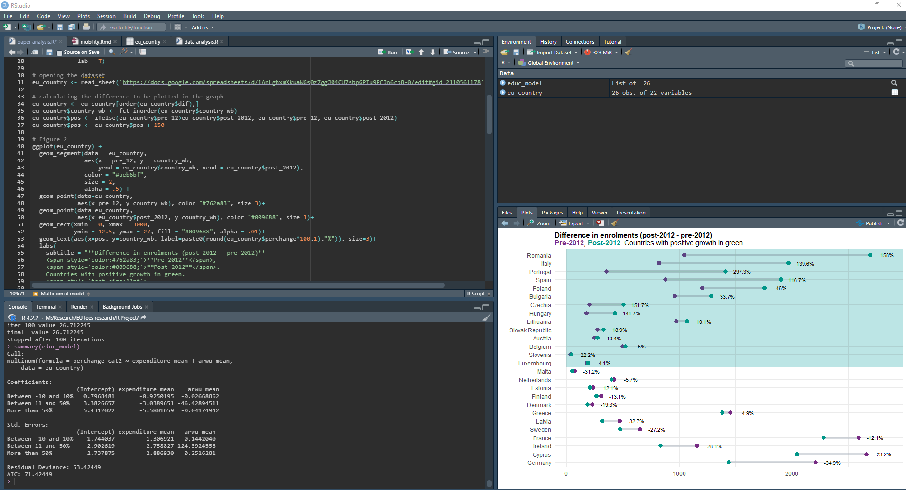

# Download and install R and RStudio

If you want to use R and RStudio to analyse the data for your MSc dissertation, you will need to download and install R and RStudio in your own computer. This pages aims to present a brief introduction to R and RStudio and a step-by-step guide on how to download and install both.

**R** is the statistical programme (and language) that will perform all the calculation and produce data visualisation for you. The R statistical programme is not very user-friendly. If you decide to open R in your computer, you will get the following - scary - screen.

  <em>What I get when I open R in my computer</em>

And that is why we need to install RStudio. To function correctly, RStudio needs R and therefore both need to be installed on your computer. 
**RStudio** is a cross-platform integrated development environment (IDE) for the R statistical language, which is a user-friendly interface R. With RStudio, you will have the console, script, history, environment and plots in one window. You can see a screenshot from my current RStudio session below

   <em>My current RStudio session</em>

## Why do we use R (RStudio) as our statistical language and programme?

R is an open source, flexible and powerful language and environment for statistical computing and graphics. It consists of a core which carries out standard statistical calculations, and a very large library of packages to do specialist functions - from amazing [data visualisations](r-graph-gallery.com/) to [apps](shiny.rstudio.com/gallery/)!

R also has a very friendly and supportive community of users. You can find countless free online courses, tutorials and foruns that help people learning R. 
If you are completly new to coding, we suggest the Data Capentries' course ["R for Social Scientists"](https://preview.carpentries.org/r-socialsci/index.html). Still, it is important to remember that you will not become coder - we are still Social Scientists! At the beginning of your R journey, google will be your best friend and you will copy and paste - or use [ChatGPT](https://www.r-bloggers.com/2022/12/chatgpt-can-create-datasets-program-in-r-and-when-it-makes-an-error-it-can-fix-that-too/) -  codes from online resources. 

## 
To download and install R, go to https://cran.r-project.org/.
You need to select the version that matches your operating system (Linux, macOS or Windows). 
 

## 
To download and install RStudio, go to https://posit.co/downloads/

RStudio is currently beung rebranded as 'Posit'- Explain
