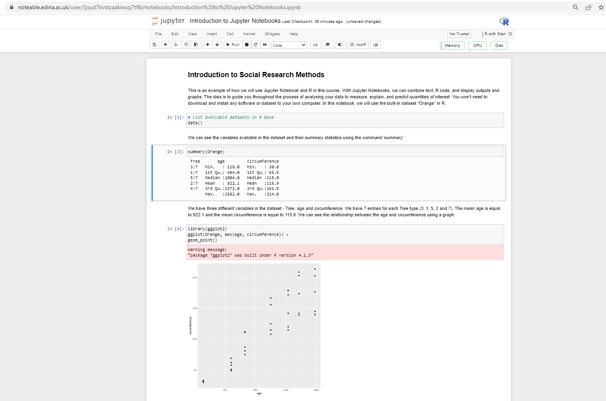

## Introduction to Jupyter Notebooks 

 Jupyter is a free, open-source, interactive web tool known as a computational notebook. With Jupyter Notebooks, we will be able to run R code, display outputs and graphs, and also add explanations in one document. “Jupyter” is a loose acronym meaning Julia, Python, and R. These programming languages were the first target languages of the Jupyter application, but nowadays, the notebook technology also supports many other languages. 

Jupyter Notebooks have become an important instrument in Open Science. They are highly reproducible, enabling other researchers to easily replicate experiments and analyse data using the same code and data sources. This enhances the transparency and reliability of research.  A lot of academic journals now accept papers accompanied by a Jupyter Notebook, documenting the entire research process. The Nobel Prize in Physics 2017 winners created tutorials with Jupyter Notebooks that describe how to use their data and reproduce analyses [(if you are brave enough and want to give a try!)](https://losc.ligo.org/tutorials/)

To learn R in this course, we will use [Noteable](https://noteable.edina.ac.uk/) which is a cloud-based application providing access to Jupyter Notebooks, developed and supported by the University of Edinburgh. Notable allows student to access Jupyter notebook at any time without going through its, painful installation process. You will have access to Noteable through the moodle page of the course. The notebooks in the course will be similar to the ones below:

You can see more interesting examples of Jupyter Notebooks here:
https://github.com/jupyter/jupyter/wiki#a-gallery-of-interesting-jupyter-notebooks

If you’re interested in learning more about Jupyter Notebooks, read their documentation or watch this [youtube video](https://www.youtube.com/embed/oJ6z02N0Te0) explaining the basics. To try out a notebook in your browser, go to https://try.jupyter.org/.
